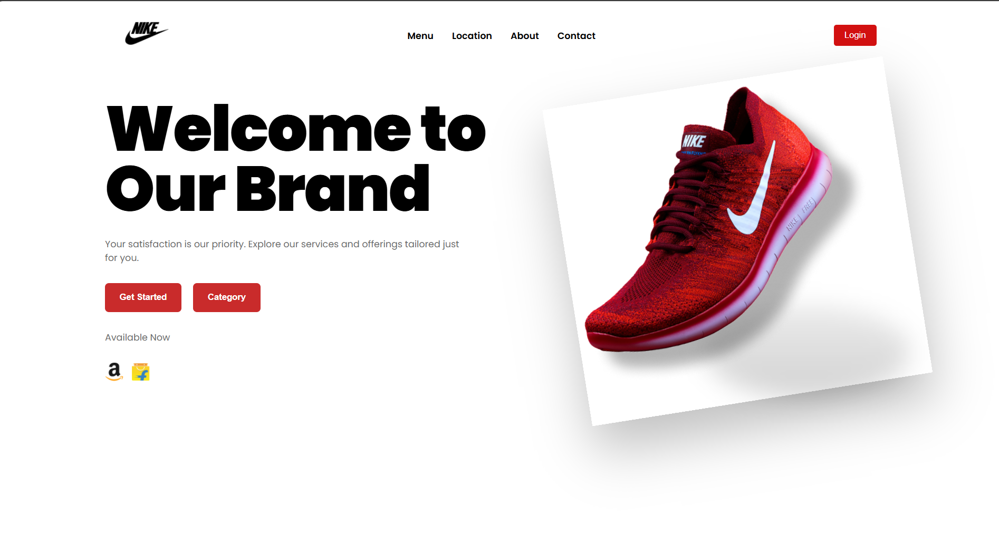

# Brand Page — React + Vite Landing Page

## Preview

Here's what our website looks like:



*Homepage featuring our latest Nike Free RN shoes*

A lightweight, responsive landing page built with React and Vite. Designed as a marketing hero for a brand: logo + navigation, a bold left-aligned headline with supporting copy and CTAs, and a large product/hero image on the right.

## Features

- Responsive hero section with a strong typographic headline and product image
- Navigation with logo and basic links
- Static image assets served from `public/images/`
- Minimal CSS in `src/App.css` for easy customization

## Project structure

- `index.html` — App entry HTML
- `src/main.jsx` — React entry point
- `src/App.jsx` — Top-level app wiring
- `src/components/Navigation.jsx` — Header and navigation
- `src/components/Home.jsx` — Hero content and hero image
- `src/App.css` — Main styles for layout and hero
- `public/images/` — Static images (logo, hero, store badges)

## How images are served

Vite's `public/` folder is served from the project root. Reference images in components using absolute paths starting with `/images/` (for example: `/images/brand_logo.png`).

## Local development

Install dependencies and start the dev server:

```cmd
npm install
npm run dev

